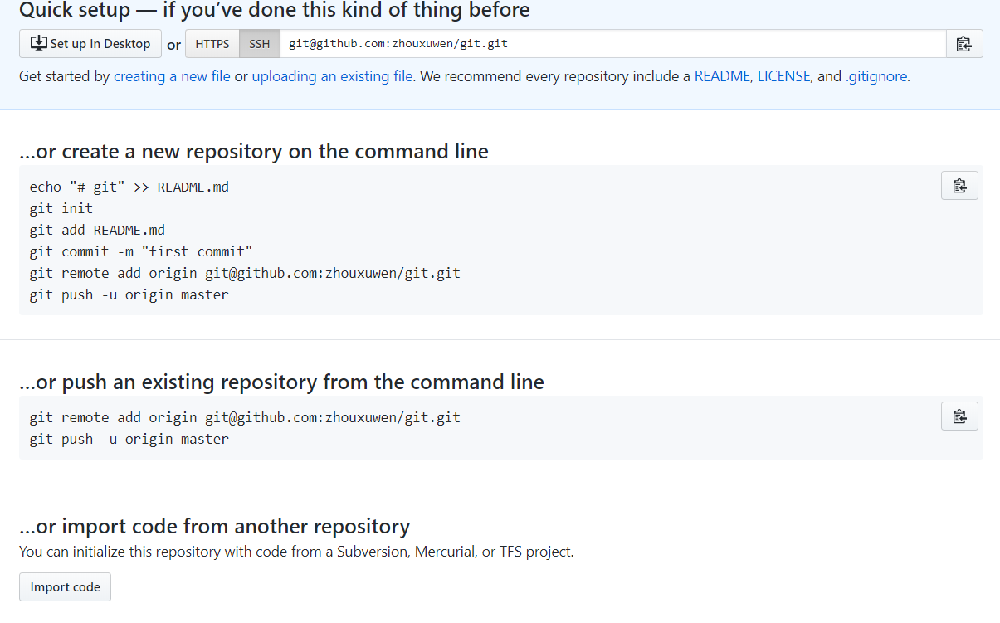

# git命令

## git基本操作

---

### git init

在当前目录创建新的Git仓库

```bash
git init [新仓库目录]
```

### git add

git add 命令可将该文件添加到缓存，每次文件修改，添加文件都需要添加到缓存，如我们添加以下两个文件：

```shell
$ touch README
$ touch hello.php
$ ls
README hello.php
$ git status -s
?? README
?? hello.php
$
```

我们可以使用 git add . 命令来添加当前项目的所有文件

```shell
git add .
```

### git status

git status 命令用于查看项目的当前状态。
我演示该命令的时候加了 -s 参数，以获得简短的结果输出。如果没加该参数会详细输出内容：

```shell
$ git status
On branch master

Initial commit

Changes to be committed:
  (use "git rm --cached <file>..." to unstage)

    new file:   README
    new file:   hello.php
```

"AM" 状态的意思是，这个文件在我们将它添加到缓存之后又有改动。改动后我们再执行 git add 命令将其添加到缓存中：

```shell
$ git status -s
AM README
A  hello.php
```

### git diff

执行 git diff 来查看执行 git status 的结果的详细信息。
git diff 命令显示已写入缓存与已修改但尚未写入缓存的改动的区别。git diff 有两个主要的应用场景。

* 尚未缓存的改动：git diff
* 查看已缓存的改动： git diff --cached
* 查看已缓存的与未缓存的所有改动：git diff HEAD
* 显示摘要而非整个 diff：git diff --stat

### git commit

使用 git add 命令将想要快照的内容写入缓存区， 而执行 git commit 将缓存区内容添加到仓库中。
Git 为你的每一个提交都记录你的名字与电子邮箱地址，所以第一步需要配置用户名和邮箱地址。

```shell
git config --global user.name 'zhouxuwen'
git config --global user.email 1916965531@qq.com
```

```shell
$ git commit -m '第一次版本提交'
[master (root-commit) d32cf1f] 第一次版本提交
 2 files changed, 4 insertions(+)
 create mode 100644 README
 create mode 100644 hello.php
```

现在我们已经记录了快照。如果我们再执行 git status:

```shell
$ git status
# On branch master
nothing to commit (working directory clean)
```

以上输出说明我们在最近一次提交之后，没有做任何改动，是一个"working directory clean：干净的工作目录"。
如果你没有设置 -m 选项，Git 会尝试为你打开一个编辑器以填写提交信息。 如果 Git 在你对它的配置中找不到相关信息，默认会打开 vim。

### git reset HEAD

git reset HEAD 命令用于取消已缓存的内容。

```shell
$ git reset HEAD hello.php
Unstaged changes after reset:
M    hello.php
$ git status -s
M  README
 M hello.php
```

### git rm

如果只是简单地从工作目录中手工删除文件，运行 git status 时就会在 Changes not staged for commit 的提示。

要从 Git 中移除某个文件，就必须要从已跟踪文件清单中移除，然后提交。

### git clone

使用 git clone 拷贝一个 Git 仓库到本地，让自己能够查看该项目，或者进行修改。
如果你需要与他人合作一个项目，或者想要复制一个项目，看看代码，你就可以克隆那个项目。 执行命令：

```bash
git clone [url]
```

例如我们克隆 Github 上的项目：

```bash
$ git clone git@github.com:schacon/simplegit.git
Cloning into 'simplegit'...
remote: Counting objects: 13, done.
remote: Total 13 (delta 0), reused 0 (delta 0), pack-reused 13
Receiving objects: 100% (13/13), done.
Resolving deltas: 100% (2/2), done.
Checking connectivity... done.
```

## git分支管理

---

### git breach

创建分支命令

```shell
git breach (breachname)
```

### git checkout

切换分支命令

```shell
git checkout (breachname)
```

### git merge

合并命令

### github远程仓库

---

由于你的本地Git仓库和GitHub仓库之间的传输是通过SSH加密的，所以我们需要配置验证信息：
使用以下命令生成SSH Key：

```shell
ssh-keygen -t rsa -C "1916965531@qq.com"
```

在~/下生成.ssh文件夹，进去，打开 id_rsa.pub，复制里面的 key
回到 github 上，进入 Account => Settings（账户配置）

为了验证是否成功，输入以下命令：

```shell
$ ssh -T git@github.com
Hi zhouxuwen! You've successfully authenticated, but GitHub does not provide shell access.
```

以上说明我们已成功连上 Github。
之后登录后点击" New repository " 创建成功后，如下图所示：



以上信息告诉我们可以从这个仓库克隆出新的仓库，也可以把本地仓库的内容推送到GitHub仓库。

现在，我们根据 GitHub 的提示，在本地的仓库下运行命令：

```shell
$ mkdir git-test                     # 创建测试目录
$ cd git-test/                       # 进入测试目录
$ echo "# Git 测试" >> README.md     # 创建 README.md 文件并写入内容
$ ls                                        # 查看目录下的文件
README
$ git init                                  # 初始化
$ git add README.md                         # 添加文件
$ git commit -m "添加 README.md 文件"        # 提交并备注信息
[master (root-commit) 0205aab] 添加 README.md 文件
 1 file changed, 1 insertion(+)
 create mode 100644 README.md

# 提交到 Github
$ git remote add origin git@github.com:zhouxuwen/git-test.git
$ git push -u origin master
```